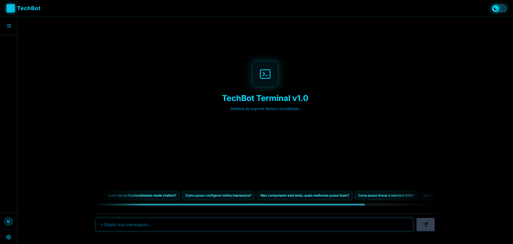
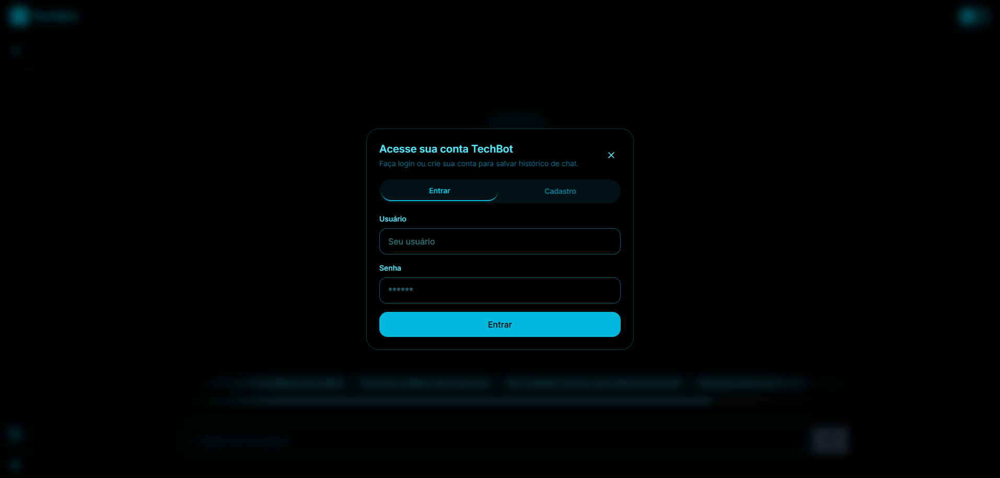
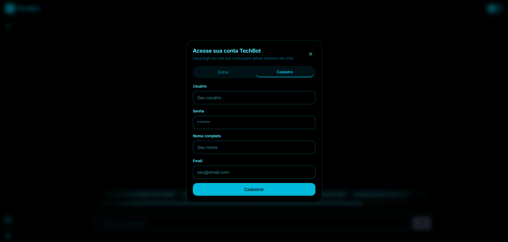
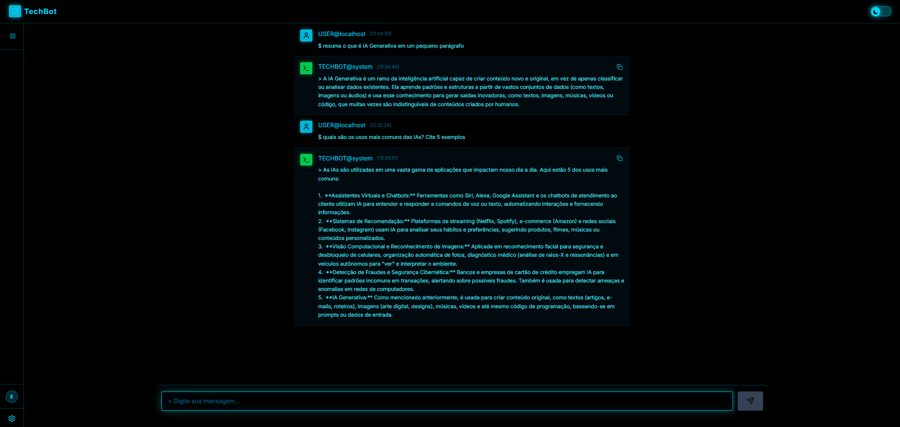

# 🤖 TechBot — Chatbot com IA Generativa

## 📌 Objetivo do Projeto

O **TechBot** é um chatbot inteligente desenvolvido com o objetivo de permitir interação em linguagem natural com usuários, utilizando IA generativa para responder perguntas, auxiliar em tarefas e simular conversas dinâmicas.

---

## 🧠 Descrição da Solução

O sistema foi desenvolvido seguindo uma arquitetura **fullstack desacoplada**, com frontend e backend separados e hospedados em serviços distintos.

O usuário realiza autenticação, inicia conversas e envia mensagens que são processadas pelo backend. O backend atua como intermediário entre o frontend e a API de IA generativa, retornando respostas em tempo real.

---

## 🛠️ Tecnologias Utilizadas

### Frontend

* React + Vite
* TypeScript
* TailwindCSS

### Backend

* Node.js
* Express
* Sequelize ORM
* SQLite
* JSONWebToken
* Bcryptjs

### Integração com IA

* Google Gemini API (IA generativa)

### Deploy

* Frontend: Vercel
* Backend: Render

---

## 🔗 Links do Projeto

* 🌐 Aplicação (Frontend):
  https://techbot-frontend.vercel.app/

* ⚙️ Backend (API):
  https://techbot-backend-llh2.onrender.com

* 📦 Repositório Frontend:
  https://github.com/emanuelsousa08/techbot-frontend

* 📦 Repositório Backend:
  https://github.com/emanuelsousa08/techbot-backend

---

## 📸 Evidências de Funcionamento

### Interface do Chat

### Login do Usuário

### Resposta da IA

---

## 🎥 Demonstração

---

## 🤖 Uso de IA Generativa

A IA generativa foi aplicada utilizando a API do **Google Gemini**, que permite gerar respostas dinâmicas com base no contexto das mensagens enviadas pelo usuário.

O backend atua como proxy seguro para a API, protegendo a chave de acesso e controlando as requisições.

A IA é responsável por:

* Interpretar mensagens em linguagem natural
* Gerar respostas contextuais
* Simular conversação inteligente

---

## ⚠️ Observações

* O backend pode apresentar pequeno atraso na primeira requisição devido ao modo gratuito do Render (cold start)
* Os dados são armazenados em SQLite, podendo não persistir entre reinicializações do servidor

---
